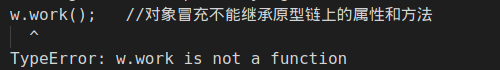
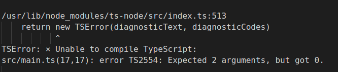
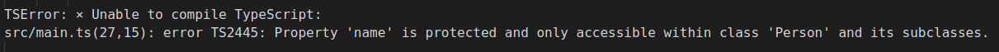
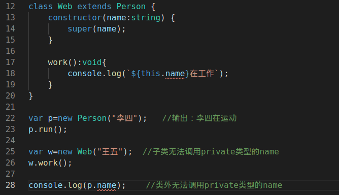

# 类和继承
## ES5中的类和继承

### 类
#### 1. 最简单的类：

``` ts
function Person(){
    //定义属性
    this.name='张三';
    this.age=20;
    //定义方法
    this.run=function(){
        console.log(this.name+'在运动');
    }
}
//初始化实例
var p = new Person();
//调用实例属性
console.log(p.name)
//调用实例方法
p.run()
```

#### 2. 在原型链上扩展属性、方法

``` ts
function Person(){
    this.name='张三';
    this.age=20;

    this.run=function(){
        console.log(this.name+'在运动');
    }
}
//原型链上的属性可以被多个实例共享，构造函数不会
Person.prototype.sex="男";
Person.prototype.work=function(){
    console.log(this.name+'在工作');
}
var p = new Person();
p.run();
p.work();
```

#### 3. 类里面的静态方法
```ts
function Person(){
    this.name='张三';
    this.age=20;
    //实例方法
    this.run=function(){
        console.log(this.name+'在运动');
    }
}
//添加静态方法
Person.getInfo=function(){
    console.log("我是静态方法");
}

var p = new Person();
p.work();//通过实例调用实例方法
Person.getInfo();//直接通过类名调用静态方法
```
### 继承

#### 4. 对象冒充实现继承
```ts
function Person(){
    this.name='张三';
    this.age=20;

    this.run=function(){
        console.log(this.name+'在运动');
    }
}
Person.prototype.sex="男";
Person.prototype.work=function(){
    console.log(this.name+'在工作');
}

//web类继承Person类     
function Web(){
    Person.call(this);//对象冒充实现继承
}
var w = new Web();
w.run();    //输出：张三在运动      对象冒充可以继承构造函数里面的属性和方法
w.work();   //报错                对象冒充不能继承原型链上的属性和方法
```


#### 5. 原型链实现继承
```ts
function Person(){
    this.name='张三';
    this.age=20;

    this.run=function(){
        console.log(this.name+'在运动');
    }
}
Person.prototype.sex="男";
Person.prototype.work=function(){
    console.log(this.name+'在工作');
}

//web类继承Person类     原型链、对象冒充的组合继承模式
function Web(){
    
}

Web.prototype = new Person();//原型链实现继承
var w=new Web();
w.run();        //输出：张三在运动  可以继承构造函数里面的属性和方法
w.work();       //输出：张三在工作  也可以继承原型链上面的属性和方法
```

#### 6. 原型链实现继承的问题
- 正常传参
```ts
function Person(name,age){
    this.name=name;
    this.age=age;

    this.run=function(){
        console.log(this.name+'在运动');
    }
}
Person.prototype.sex="男";
Person.prototype.work=function(){
    console.log(this.name+'在工作');
}

var p = new Person("李四",20);
p.run();    //输出：李四在运动
```
- 原型链继承后传参
```ts
function Person(name,age){
    this.name=name;
    this.age=age;

    this.run=function(){
        console.log(this.name+'在运动');
    }
}
Person.prototype.sex="男";
Person.prototype.work=function(){
    console.log(this.name+'在工作');
}

function Web(name,age){

}
Web.prototype = new Person();   //原型链实现继承

var w=new Web('王五',20);
w.run();   //错误      实例化子类的时候没法给父类传参
```


#### 7. 原型链+对象冒充组合继承模式
- 方式一
```ts
function Person(name,age){
    this.name=name;
    this.age=age;

    this.run=function(){
        console.log(this.name+'在运动');
    }
}
Person.prototype.sex="男";
Person.prototype.work=function(){
    console.log(this.name+'在工作');
}

function Web(name,age){
    Person.call(this.name,age);//对象冒充继承   实例化子类可以给父类传参
}
//方式一
Web.prototype = new Person();
var w=new Web('赵四',20);
w.work();
```

- 方式二
```ts
function Person(name,age){
    this.name=name;
    this.age=age;  

    this.run=function(){
        console.log(this.name+'在运动');
    }
}
Person.prototype.sex="男";
Person.prototype.work=function(){
    console.log(this.name+'在工作');
}

function Web(name,age){
    Person.call(this.name,age);//对象冒充继承   实例化子类可以给父类传参
}
//方式二
Web.prototype = Person.prototype;   
var w=new Web('赵四',20);
w.work();
```

## Typescript中的类和继承

#### 1. 最简单的类：

```ts
class Person {
    name:string;    //属性  前面省略了public关键字
    //构造函数在实例化类时触发的方法
    constructor(name:string) {   
        this.name=name;
    }

    getName():string{
        return this.name;
    }
    setName(name:string):void{
        this.name=name;
    }


}
var p=new Person('张三');
console.log(p.getName());   //输出：张三

p.setName('李四');
console.log(p.getName());   //输出：李四

```

#### 2. ts中实现继承     extends、super

```ts
class Person {
    name:string;
    constructor(name:string) {
        this.name=name;
    }
    run():string{
        return `${this.name}在运动`
    }
}
var p=new Person('王五');
console.log(p.run());   //输出：王五在运动

class Web extends Person {
    //在继承时，需要写上构造函数，并且使用super调用父类构造函数
    constructor(name:string) {
        super(name);
    }
}

var w=new Web('李四')
console.log(w.run());   //输出：李四在运动

```
#### 3. 父类和子类的方法

- 子类继承父类方法，并且可以扩展其他方法
- 子类和父类方法相同时，则调用子类中的方法

#### 4. 类里面的修饰符   typescript中定义属性时给我们提供了三种修饰符

|修饰符|本类|子类|类外
|-----|-----|-----|-|
|public(公有)|√|√|√|
|protected(保护类型)|√|√|×|
|private(私有)|√|×|×|
属性如果不加修饰符，则默认public

- public示例：
```ts
class Person {
    public name:string;     //公有类型
    constructor(name:string) {
        this.name=name;
    }
    run():string{
        return `${this.name}在运动`
    }
}
var p=new Person('张三');
console.log(p.name);    //输出：张三，类外可访问name属性

```

- protect示例：
```ts
class Person {
    protected name:string;  //保护类型
    constructor(name:string) {
        this.name=name;
    }
    run():string{
        return `${this.name}在运动`
    }
}


class Web extends Person {
    constructor(name:string) {
        super(name);
    }

    work():string{
        return `${this.name}在工作`
    }
}

var p=new Person('王五');
var w=new Web('李四')
console.log(p.run());   //输出：王五在运动  类中可访问name
console.log(w.work());   //输出：李四在运动  子类可访问name

console.log(p.name);    //报错  类外不可访问protected类型的name
```


- private示例

```ts
class Person {
    private name:string;  //保护类型
    constructor(name:string) {
        this.name=name;
    }
    run():string{
        return `${this.name}在运动`
    }
}


class Web extends Person {
    constructor(name:string) {
        super(name);
    }

    work():void{
        console.log(`${this.name}在工作`);
    }
}

var p=new Person("李四");   //输出：李四在运动
p.run();

var w=new Web("王五");  //子类无法调用private类型的name
w.work();

console.log(p.name);    //类外无法调用private类型的name

```


#### 5. 静态属性 静态方法

##### ES5中的静态属性和方法
```ts
function Person() {
    this.run1=function () {
        
    }
}
Person.name="张三";         //静态属性
Person.run2=function () {  //静态方法
    
}
var p=new Person();
Person.run2();//静态方法的调用
```

模拟jQ中的方法封装：
```js
function $(element){
    return new Base(element)
}

$.get=function(){       //创建静态方法

}

function Base(element) {
    this.element=获取dom节点;

    this.css=function(arr,value){
        this.element.style.arr=value;
    }
}

$('#box').css('color','red')    
$.get('url',function () {       //调用静态方法
    
})
```

##### ES5中的静态属性和方法
```ts
class Person {
    public name:string;
    public age:number=20;
    static sex:string='男';
    constructor(name:string) {
        this.name=name;
    }
    run(){
        console.log(`${this.name}在运动`);
    }
    work(){
        console.log(`${this.name}在工作`);
    }
    static print(){
        console.log('print方法');
        console.log('print方法'+this.age);  //× 静态方法  无法直接调用类中的属性
        console.log('print方法'+this.sex);  //√ 静态方法  可调用静态属性
    }
}

Person.print();     //通过类名调用静态方法
```

## 多态
定义：父类定义一个方法不去实现，让继承它的子类去实现，每一个子类有不同的表现
多态属于继承

```ts
class Animal {
    name:string;
    constructor(name:string) {
        this.name=name
    }
    eat(){          //具体怎么实现，不知道  由它的子类来实现，每个子类的表现不一样
        console.log('吃的方法');
    }
}

class Dog extends Animal {
    constructor(name:string) {
        super(name)
    }
    eat(){
        return this.name+'吃肉'
    }
}

class Cat extends Animal {
    constructor(name:string) {
        super(name)
    }
    eat(){
        return this.name+'喝水'
    }
}
```

## 抽象类和抽象方法
- typescript中的抽象类：它是提供其他类继承的基类，**不能直接被实例化**
- 用`abstract`关键字定义抽象类和抽象方法，抽象类中的抽象方法不包含具体实现，并且**必须在派生类中实现**
- abstract抽象方法**只能放在抽象类里**面
- 抽象类和抽象方法用来**定义标准**，Animal这个类要求它的子类必须包含eat方法
```ts
abstract class Animal {
    public name:string;
    constructor(name:string){
        this.name=name;
    }
    abstract eat():any;
}

//var a=new Animal()    错误写法，不能实例化抽象类

class Dog extends Animal {
    constructor(name:any) {
        super(name)
    }
    eat(){      //必须实现抽象类中的抽象方法,其他方法不作要求
        console.log(this.name+'吃肉');
    }
}

var d=new Dog('狗狗');
d.eat()

```