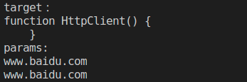

# 装饰器

装饰器：装饰器是一种特殊类型的声明，它能够被附加到类声明、方法、属性或参数上，可以修改类的行为。  
通俗地讲，装饰器就是一个方法，可以注入到类、方法、属性或参数上来扩展类、方法、属性、参数的功能  
常见的装饰器有：
- 类装饰器
- 属性装饰器
- 方法装饰器
- 参数装饰器

装饰器的写法：普通装饰（无法传参）、装饰器工厂（可传参）
装饰器时过去几年中js最大的成就之一，已是Es7标准特性之一

## 1.类装饰器
类装饰器在类声明之前被声明（紧靠着类声明），类装饰器应用于类的构造函数，可以用来监视、修改或替换类定义，传入一个参数

```ts
//装饰器
function logClass(params:any) {
    console.log(params);

    //params就是当前类

    params.prototype.apiUrl='动态扩展的属性';

    params.prototype.run=function(){
        console.log('动态扩展的方法');
    }
}

//类装饰器作用：动态扩展类的属性和方法，在不修改类的前提下，扩展类的功能
@logClass
class HttpClient {
    constructor() {
        
    }

    getData(){

    }
}

var http:any = new HttpClient();

console.log(http.apiUrl);
http.run();
```


## 2. 装饰器工厂（带参数）

```ts
function logClass(params:string) {
    return function(target:any) {
        console.log('target：\n'+target);
        console.log('params:\n'+params);

        target.prototype.apiUrl = params;

    }
}

@logClass('www.baidu.com')
class HttpClient {
    constructor() {
    }

    getData(){
    }
}

var http:any = new HttpClient();
console.log(http.apiUrl)
```


## 3. 类装饰器的举例
下面是一个重载构造函数的例子。  
类装饰器表达式会在运行时当作函数被调用，类的构造函数作为其唯一的参数。  
如果类装饰器返回一个值，它会使用提供的构造函数来替换类的声明

```ts
function logClass(target:any){
    console.log(target);

    //在装饰器里重载构造函数,固定写法
    return class extends target{
        apiUrl:any = '修改后的数据'

        getData(){
            this.apiUrl = this.apiUrl+'----'
            console.log(this.apiUrl);
        }
    }
}

@logClass
class HttpClient {
    public apiUrl:string | undefined;
    constructor() {
        this.apiUrl='构造函数里的apiUrl'
    }

    getData(){
        console.log(this.apiUrl);
    }
}

var http = new HttpClient();
http.getData();
```

## 4. 属性装饰器
属性装饰器表达式会在运行时当作函数被调用，传入下列2个参数：
- 对于静态成员来说是类的构造函数，对于实例成员时类的原型函数
- 成员的名字
```ts
function logProperty(params:any){
    return function(target:any,attr:any){
        console.log(params);
        console.log(target);
        console.log(attr);
        target[attr] = params;
    }
}

class HttpClient {
    @logProperty('www.baidu.com')
    public apiUrl:string | undefined;
    constructor() {
    }

    getData(){
        console.log(this.apiUrl);
    }
}

var http = new HttpClient();
http.getData();
```


## 5. 方法装饰器
它会被应用到方法的 属性描述符上，可以用来监视，修改或者替换方法定义
方法装饰会在运行时传入下列3个参数：
- 对于静态成员来说是类的构造函数，对于实例成员是类的原型对象。
- 成员的名字。
- 成员的属性描述符。

```ts
function get(params:any) {
    return function (target:any,methodName:any,desc:any) {
        console.log(target);
        console.log(methodName);
        console.log(desc);

        //扩展属性和方法
        target.apiUrl = 'xxx';
        target.run=function () {
            console.log('run');
        }
        //修改装饰器的方法（getDate方法），将装饰器方法里面传入的所有参数改为string类型
        //1. 保存当前的方法

        var oMethod = desc.value;
        desc.value = function(...args:any[]) {
            
            args = args.map((value)=>{
                return String(value);
            })
            console.log(args);
        
            //对象冒充实现修改方法。不加这一句，就是重写了getDate()方法。
            oMethod.apply(this,args)//此处this就是上面的function
        }
    }
}
class HttpClient {
    public url:any | undefined;
    constructor() {
    }
    @get('www')
    getData(){
        console.log('我是getData里的方法');
    }
}

var http:any = new HttpClient();
console.log(http.apiUrl);
http.run();

http.getData('123',456);

```


## 6. 方法参数装饰器
参数装饰器表达式会在运行时当作函数被调用，可以使用参数装饰器为类的原型增加一些元素数据，传入下列3个参数
- 对于静态成员来说是类的构造函数，对于实例成员是类的原型对象。
- 方法的名字。
- 参数在函数参数列表中的索引。

```ts
function logParams(params:any) {
    return function(target:any,methodName:any,paramsIndex:any) {
        console.log(params);

        console.log(target);
        console.log(methodName);
        console.log(paramsIndex);
        
        //为类的原型添加元数据
        target.apiUrl = params;
    }
}
class HttpClient {
    public url:any | undefined;
    constructor() {
    }
    getData(@logParams('uuid') uuid:any){
        console.log('我是getData里的方法');
    }
}

var http:any = new HttpClient();
http.getData();
console.log(http.apiUrl);
```


## 7. 装饰器执行顺序

由前往后：
属性->方法->方法参数->类
如果有多个同样的装饰器，先会执行后面的
```ts
function logClass1(params:string){
    return function(target:any){
      console.log('类装饰器1')
    }
}

function logClass2(params:string){
    return function(target:any){
      console.log('类装饰器2')
    }
}

function logAttribute1(params?:string){
    return function(target:any,attrName:any){
      console.log('属性装饰器1')
    }
}

function logAttribute2(params?:string){
    return function(target:any,attrName:any){
      console.log('属性装饰器2')
    }
}

function logMethod1(params?:string){
    return function(target:any,attrName:any,desc:any){
      console.log('方法装饰器1')
    }
}
function logMethod2(params?:string){
    return function(target:any,attrName:any,desc:any){
      console.log('方法装饰器2')
    }
}


function logParams1(params?:string){
    return function(target:any,attrName:any,desc:any){
      console.log('方法参数装饰器1')
    }
}

function logParams2(params?:string){
    return function(target:any,attrName:any,desc:any){
      console.log('方法参数装饰器2')
    }
}


@logClass1('http://www.itying.com/api')
@logClass2('xxxx')
class HttpClient{
    @logAttribute1()
    @logAttribute2()
    public apiUrl:string | undefined;
    constructor(){
    }

    @logMethod1()
    @logMethod2()
    getData(){
        return true;
    }

    setData(@logParams1() attr1:any,@logParams2() attr2:any,){

    }
}

var http:any=new HttpClient();
```
